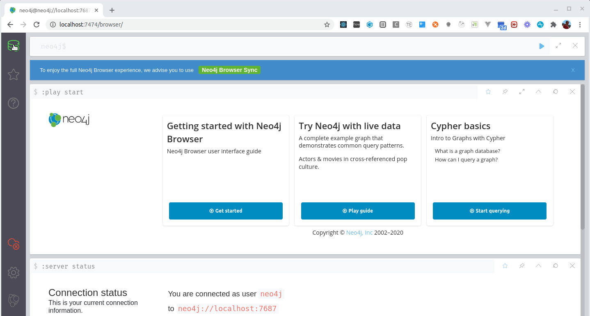

# Ejemplo Películas con Springboot y Neo4J

[](https://github.com/uqbar-project/eg-peliculas-springboot-neo4j-kotlin/actions/workflows/build.yml) [](https://codecov.io/gh/uqbar-project/eg-peliculas-springboot-neo4j-kotlin)

## Objetivo

Testea el mapeo de una API que expone la [base de grafos de Películas que viene con Neo4J](https://neo4j.com/developer/example-project/).

## Modelo Neo4j

El ejemplo Movies que viene con Neo4j propone

* un nodo película (Movies)
* un nodo para cada actor (Person)
* y la relación entre ellos, marcada por el o los roles que cumplió cada actor en una película (ACTED_IN)

## Carga inicial de datos

Instalar previamente Neo4j o bien levantar una imagen de Docker

```bash
docker run -p7474:7474 -p7687:7687 -e NEO4J_AUTH=neo4j/s3cr3t neo4j
```

- Abrir el Navegador de Neo4J Desktop o bien ingresar manualmente a la URL: http://localhost:7474
- Ejecutar el script que carga el grafo de películas (viene como ejemplo)



## Configuración

En el archivo [`application.yml`](./src/main/resources/application.yml) encontrarás la configuración hacia la base de grafos, que utiliza el protocolo liviano **bolt**:

```yml
spring:
  data:
    neo4j:
      uri: bolt://localhost:7687
      username: neo4j
      password: #####
logging:
  level:
    org.springframework.data: DEBUG
    org.neo4j: DEBUG
```

Algunas consideraciones:

- la contraseña por defecto cuando instalás localmente Neo4J es **neo4j** pero a veces te obliga a cambiarla, acordate de sincronizar con esta configuración (de hecho en el ejemplo de Docker estamos usando s3cr3t)
- el puerto por defecto para el protocolo bolt es 7687
- respecto al logging, le pusimos una configuración bastante exhaustiva: vas a ver conexiones y queries a la base. Se puede desactivar subiendo el nivel a INFO, WARN o directamente borrando la línea

## Las consultas

### Películas por título

Para conocer las películas en donde un valor de búsqueda esté contenido en el título (sin distinguir mayúsculas o minúsculas), y limitando la búsqueda a los primeros 10 nodos, ejecutaremos esta consulta

```cypher
MATCH (pelicula:Movie) WHERE pelicula.title =~ '.*Good.*' RETURN pelicula LIMIT 10
```

La interfaz _Neo4jRepository_ de Spring boot nos permite declarativamente establecer las consultas a la base, y reemplazaremos el valor concreto '.*Good.*' por el parámetro que recibe el contrato:

```kt
@Query("MATCH (pelicula:Movie) WHERE pelicula.title =~ \$titulo RETURN pelicula LIMIT 10")
fun peliculasPorTitulo(titulo: String): List<Pelicula>
```

`$titulo` es la nueva forma de asociar el valor del parámetro `titulo` (hay que respetar los mismos nombres). Dado que queremos armar la expresión _contiene_, esto debemos hacerlo antes de llamar al repositorio, en este caso es el Service):

```kt
@Transactional(readOnly = true)
fun buscarPorTitulo(titulo: String) =
    peliculasRepository.peliculasPorTitulo(titulo.contiene())
```

- la anotación `@Transactional(readOnly = true)` le marca a Springboot que no necesita enmarcar al método dentro de una transacción (de esa manera utiliza menos recursos ya que no necesita registrar lo que va haciendo para poder deshacer los cambios)
- `contiene` es en realidad un _extension method_ definido en el archivo CipherUtils:

```kt
fun String.contiene() = """(?i).*$this.*"""
```

En este caso solo queremos traer el nodo película, sin sus relaciones, por lo que el endpoint devuelve una lista de personajes vacía. Esto mejora la performance de la consulta aunque hay que exponer esta decisión a quien consuma nuestra API.

### Ver los datos de una película concreta

Cuando nos pasen un identificador de una película concreta, ahora sí queremos traer los datos de la película, más sus personajes y eso incluye los datos de cada uno de sus actores:

```cypher
MATCH (pelicula:Movie)<-[actuo_en:ACTED_IN]-(persona:Person) WHERE ID(pelicula) = $id RETURN pelicula, collect(actuo_en), collect(persona) LIMIT 1
```

Es importante utilizar la instrucción [`collect`](https://neo4j.com/docs/cypher-manual/current/functions/aggregating/#functions-collect) para que agrupe correctamente los personajes y los actores.

### Actualizaciones a una película

Es interesante ver que el controller delega la creación, actualización o eliminación al service, que delimita la transaccionalidad. Por ejemplo, la creación de una película:

```kt
@PostMapping("/pelicula")
@ApiOperation("Permite crear una nueva película con sus personajes.")
fun createPelicula(@RequestBody pelicula: Pelicula) =
    peliculaService.guardar(pelicula)
```

El service, a su vez, define que el método es transaccional y delega al repositorio:

```kt
@Transactional
fun guardar(pelicula: Pelicula): Pelicula {
    pelicula.validar()
    peliculasRepository.save(pelicula)
    return pelicula
}
```

los métodos de CRUD (Create, Retrieve, Update, Delete) ni siquiera es necesario que los defina nuestra interfaz, porque ya están siendo inyectados por la interfaz Neo4jRepository (la declaratividad en su máxima expresión). El motor, en este caso Spring boot, persiste el nodo película y [cualquier relación hasta el nivel de profundidad 5 que no entre en referencia circular](https://community.neo4j.com/t/repository-save-find-depth/15181). Anteriormente, existía un SessionManager donde podíamos tener un mayor control de la información que actualizábamos o recuperábamos: para algunos esto puede ser una desventaja, contra lo bueno que puede suponer delegar esa responsabilidad en un algoritmo optimizado.

## Mapeos

Mostraremos a continuación cómo es el mapeo de las películas (las anotaciones a partir de las últimas versiones de Neo4J 4.2.x cambiaron ligeramente)

```kt
@Node("Movie")
class Pelicula {

    @Id @GeneratedValue
    var id: Long? = null

    @Property(name="title") // OJO, no es la property de xtend sino la de OGM
    lateinit var titulo: String

    @Property("tagline")
    var frase: String? = null

    @Property("released")
    var anio: Int = 0

    @Relationship(type = "ACTED_IN", direction = Direction.INCOMING)
    var personajes: MutableList<Personaje> = mutableListOf()
```

Para profundizar más recomendamos ver los otros objetos de dominio en este ejemplo y [la página de mapeos de Neo4j - Spring boot](https://docs.spring.io/spring-data/neo4j/docs/current/reference/html/#mapping)

## Sobre los identificadores

Por motivos didácticos hemos mantenido un ID Long que es el que genera Neo4J para sus nodos, aunque [**no resulta una buena estrategia**](https://stackoverflow.com/questions/27336536/reuse-of-deleted-nodes-ids-in-neo4j), ya que cuando eliminamos nodos, Neo4j reutiliza esos identificadores para los nodos nuevos. Recomendamos investigar mecanismos alternativos para generar claves primarias, o bien tener como estrategia el borrado lógico y no físico.

## Tests de integración

Elegimos hacer tests de integración sobre el controller

- buscando películas por título
- o buscando concretamente por id
- actualizando una película existente
- creando y luego eliminando una película
- buscando una película inexistente
- eliminando una película inexistente
- actualizando una película inexistente
- creando / actualizando películas con errores de validación (esperamos un bad request)

La parte interesante es que 

- utilizamos una base de Neo4J embebida dentro de un companion object (lo que representa un elemento _static_ o de clase)
- creamos un juego de datos de prueba antes de cada test
- al finalizar cada test eliminamos los datos creados (esto permite iniciar cada test como si fuera desde cero)

```kt
@SpringBootTest
@AutoConfigureMockMvc
@ActiveProfiles("test")
@EnableAutoConfiguration
class PeliculaControllerTest {
    @Autowired
    lateinit var peliculasRepository: PeliculasRepository

    @Autowired
    lateinit var actoresRepository: ActoresRepository

    @Autowired
    lateinit var mockMvc: MockMvc

    companion object {
        var mapper = ObjectMapper()
        lateinit var embeddedDatabaseServer: Neo4j

        @BeforeAll
        @JvmStatic
        fun initializeNeo4j() {
            embeddedDatabaseServer = Neo4jBuilders.newInProcessBuilder()
                .withDisabledServer()
                .build()
        }

        @AfterAll
        @JvmStatic
        fun stopNeo4j() {
            embeddedDatabaseServer.close()
        }

        @DynamicPropertySource
        @JvmStatic
        fun neo4jProperties(registry: DynamicPropertyRegistry) {
            registry.add("spring.neo4j.uri", embeddedDatabaseServer::boltURI)
            registry.add("spring.neo4j.authentication.username") { "neo4j" }
            registry.add("spring.neo4j.authentication.password") { null }
        }
    }

    lateinit var nueveReinas: Pelicula

    @BeforeEach
    fun init() {
        val darin = Actor().apply {
            nombreCompleto = "Ricardo Darín"
            anioNacimiento = 1957
        }
        nueveReinas = peliculasRepository.save(Pelicula().apply {
            titulo = "Nueve reinas"
            frase = "Dos estafadores, una mujer... y mucho dinero"
            anio = 1998
            personajes = mutableListOf(
                Personaje().apply {
                    roles = mutableListOf("Marcos")
                    actor = darin
                },
                Personaje().apply {
                    roles = mutableListOf("Juan")
                    actor = Actor().apply {
                        nombreCompleto = "Gastón Pauls"
                        anioNacimiento = 1972
                    }
                }
            )
        })
        peliculasRepository.save(Pelicula().apply {
            titulo = "Tiempo de valientes"
            frase = "Los tiempos cambian. Los héroes también."
            anio = 2005
        })

    }

    @AfterEach
    fun `delete fixture`() {
        actoresRepository.deleteAll()
        peliculasRepository.deleteAll()
    }

    @Test
    fun `la busqueda por titulo funciona correctamente, no importan mayusculas`() {
        mockMvc.perform(
            MockMvcRequestBuilders.get("/peliculas/nueve")
                .contentType(MediaType.APPLICATION_JSON)
        )
            .andExpect(MockMvcResultMatchers.status().isOk)
            .andExpect(MockMvcResultMatchers.content().contentTypeCompatibleWith(MediaType.APPLICATION_JSON))
            .andExpect(MockMvcResultMatchers.jsonPath("$.length()").value(1))
            .andExpect(MockMvcResultMatchers.jsonPath("$[0].titulo").value("Nueve reinas"))
            .andExpect(MockMvcResultMatchers.jsonPath("$[0].personajes.length()").value(0))
    }
    
    ...
}
```

Para profundizar más en el tema recomendamos leer [esta página](https://medium.com/neo4j/testing-your-neo4j-based-java-application-34bef487cc3c)

## Open API / Swagger

Como de costumbre, pueden investigar los endpoints en el navegador mediante la siguiente URL:

```url
http://localhost:8080/swagger-ui/index.html#
```

## Cómo testear la aplicación en Insomnia

Te dejamos [el archivo de Insomnia](./Peliculas_Insomnia.json) con ejemplos para probarlo.
